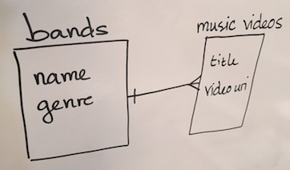
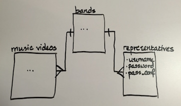

# Example Video Application

This is an example for the class of what a well-structured Rails
app looks like. Check the commit logs for useful, step-by-step 
information.

## Data Model & ERD

#### MVP

#### Sprint 2

A `Band` can have many `MusicVideo`s, and many `BandRep`s, and has the 
following attributes:

- `name`
- `genre`

A `MusicVideo` belongs to a `Band`, and has the following attributes:

- `title`
- `video_embed_url`

A `BandRep` belongs to a `Band`, and maps to a user account, so it needs:

- `username` (ie, an email)
- `password_digest`
- (`has_secure_password` will create the other necessary methods)

## User Stories

### MVP

- [x] As a user, I would like to land on a page that explains what the site is 
  (a "home" page).
- [x] As a user, I would like to see a list of available bands on the home page.
- [x] As a user, I would like to be able to go to a band's page and see a list of
  their videos.
- [x] As a user, I would like to be able to load a given YouTube video for a
  band's song within the page.

### Sprint 2

- [x] As a user, I would like to be able to log in as a member of, or representative
  of, a band.
- [ ] As a band rep, I would like to be able to create a new band.
- [ ] As a band rep, I would like to be able to add or remove videos for a band.

### Iceboxed

- [ ] As a user, I would like to be able to add "pop-ups", or comments, to a video.
  These pop-ups would include a time in the video (in minutes and seconds) and
  a fun fact about what's happenning on the screen. The pop-up can also be
  tagged as "funny", "informative", or "wry".
- [ ] As a user, I would like the pop-ups to have unique times (only one pop-up) per
  second.
- [ ] As a user, I would like to choose to either view or hide a videos' pop-ups.
- [ ] As a user, I would like to have the pop-ups only be visible for the second
  that they are attached to in the video.
